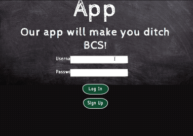

# Sch00led App
Sch00led App is a class management app. Sch00led allows users to create classes or join classes created by other users. As instructors, users can post assignments,grade assignments and see all previous assignment submissions by students. As students, users join classes, submit assignments and can see their last submission for that specific assignment. Students can also view their grades once a teacher has submitted a grade. Sch00led aims to solve the need for a simpler/concise classroom management system where everything can be accessed in one platform.


* [Live Demo](https://sch00led.herokuapp.com/)
* [Video Demo](https://youtu.be/scpvt3I9q3I)

## Getting Started
These instructions will get you a copy of the project up and running on your local machine for development and testing purposes. See deployment for notes on how to deploy the project on a live system.

### Prerequisites
1. Install Node.js  (https://nodejs.org/en/download/)
2. Install MySQL (https://www.mysql.com/downloads/)

### Installing
1. Clone the github repo using command line:
```
git clone https://github.com/michellele994/ClassroomApp.git
``` 
2. Using command line go to the ClassroomApp directory
```
cd ClassroomApp
```
3. Reset Database: Copy the schema,in the db folder,paste it into your desired mysql interface/command line.
4. Once in the ClassroomApp directory install the package.json
```
npm install
```
5. Run the application
```
node server.js
```
6. If successfull you should see the following message on you command line, 
```
App listening on PORT 8080
```

## Running the tests

1. Go to ClassroomApp directory run in command line
```
npm test
```

## Deployment
Follow Heroku's deployment instructions
* https://devcenter.heroku.com/articles/git
* Add JawsDB MySQL add-on

## Built With
* [Handlebars](http://handlebarsjs.com/) -Templating language used
* [Sequelize](http://docs.sequelizejs.com/) - Promised-based ORM 
* [Express](http://expressjs.com/) - Web framework used
* [Mocha](https://mochajs.org/) - Used as testing framework
* [chai](http://www.chaijs.com/) - Assertion library paired with Mocha for testing

## New Technologies Used

Aside from the one-to-many associations used, we have also explored using many-to-many associations. This was initially a challenge as there is a lack of clear documentation to begin making these associations. We will attempt to explain it in a clear and concise way.

### Declaring a belongsToMany Association

With all associations, start with the creation of two models that you intend to make associated to one another. Documentation for creating models can be found here. http://docs.sequelizejs.com/manual/tutorial/models-definition.html

For example, in our case, we have model "Student" that will be associated to models "ExistingClass"

We want it so that a class (ExistingClass) can have multiple students (Students), and students (Students) can have multiple classes (ExistingClasses). 

After making the two models, declare the associations. Refer to the snippets below, taken from our application in our "models" folder.

 * To say that Student has many ExistingClasses,

	```
	Student.associate = function(models) {
		Student.belongsToMany(models.ExistingClass, { through: "StudentClassroomRoster"});
	};
	```


 * To say that ExistingClass has many Students

	```
	ExistingClass.associate = function(models) {
		ExistingClass.belongsToMany(models.Student, { through: "StudentClassroomRoster"});
	};
	```

 * This looks similar to the declaration of a belongsTo association.
For example, an association we have between model Teacher and model ExistingClass is that a Teacher can have multiple ExistingClasses, but an ExistingClass can only have one Teacher. Simplified example snippet from models/ExistingClass.js:

	```
	ExistingClass.associate = function(models) {
		ExistingClass.belongsTo(models.Teacher);
	};
	```

 ** Documentation on making belongsTo is adequately explained here http://docs.sequelizejs.com/manual/tutorial/associations.html#one-to-many-associations-hasmany-.

The difference between using belongsTo and belongsToMany is the use of  **"through"**. This is to declare the name of the join table! For the version of sequelize (4.33.4), defining this is required or else it will not run properly.

So in our example of Student and ExistingClass, we define the join table's name as "StudentClassroomRoster". In this join table, Student and ExistingClass are joined by their id. **Ensure that both models have the same value of "through" before continuing.** To adjust names and foriegnkeys, please refer to sequelize documentation here: http://docs.sequelizejs.com/manual/tutorial/associations.html#belongs-to-many-associations

Declaring that these two models are associated automatically gives us additional methods to use between the two models.

The methods we can now begin using:
```
ExistingClass.getStudent();
ExistingClass.getStudents();
ExistingClass.addStudent(newStudent);
ExistingClass.addStudents(newStudents);

Student.getExistingClass();
Student.getExistingClasses();
Student.addExistingClass(newClass);
Student.addExistingClasses(newClasses);
```

### CREATING THE ASSOCIATION

So now we have our models. Lets start associating them.
We make the association when a student enrolls into a class.

For our application, all the action occurs in posts-routes.js. Feel free to inspect it for more information.
 * Here is a condensed and simplified snippet of what it should look like when a student joins a class (This snippet originally involved association of Homework, but I have removed it in this snippet for demonstration-purposes).

	```
	db.ExistingClass.findOne({
            where: {
                id: req.body.classid //finding the one class
            }
        }).then(function(currentClass){
            db.Student.findOne({
                where: {
                    username: req.body.username //finding the one student
                }
            }).then(function(currentStudent){
                currentClass.addStudent(currentStudent); //adding to join table happens here.
            })
        });
    ```

Now your Student is associated to an ExistingClass!

### ADDING ATTRIBUTES TO JOIN TABLE

In the Homework to Student association, we have added additional attributes such as "completed","grade", etc to the join table called "AssignedHomework". In order to do this, you must FIRST define a model for the join table (Please see /models/assignedhw.js for an example).

In our application, when we first associate Student to Homework, we set "completed" to false by just running the following:

```
thisHomework.addStudent(thisStudent, { through: { completed: false }});
```

Be sure that your models have declared an association for both models. Also be sure that"thisHomework" and "thisStudent" are filtered from the database and are objects.

That's it for the basic declaration and creating of belongsToMany association!

## Authors
* **Michelle Le** - *Team Lead* - [GitHub](https://github.com/michellele994)
* **Brandon Haines** - *Team:Front-end* - [GitHub](https://github.com/bhaines3)
* **Ernesto Samaniego** - *Team:Front-end* - [GitHub](https://github.com/ernesto13)
* **Perla Ballesteros** - *Team:Front-end/Back-end* - [GitHub](https://github.com/perlaballesteros)

## Acknowledgments
* BootcampSpot
* Classroom Sequelize Examples
